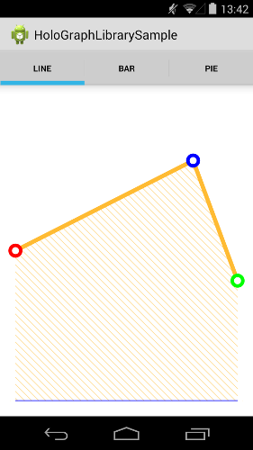
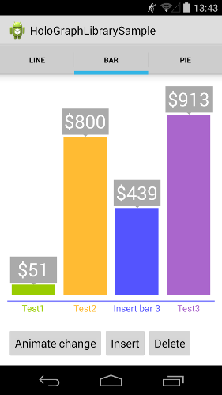
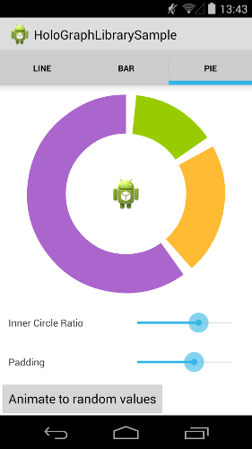

# HoloGraphLibrary

This is a library written to allow beautiful graphs and charts to be easily incorporated into your Android application. Included are:

* LineGraph view
* BarGraph view
* PieGraph view








## Usage

### Gradle build

Then, to use the library in your project add the following to your `build.gradle`:

```groovy
dependencies {
    compile 'com.echo:holographlibrary:1.0.0'
}
```

### LineGraph view

```xml
<com.echo.holographlibrary.LineGraph
        android:layout_width="match_parent"
        android:layout_height="200dp"
        android:id="@+id/graph"/>
```

```java
Line l = new Line();
LinePoint p = new LinePoint();
p.setX(0);
p.setY(5);
l.addPoint(p);
p = new LinePoint();
p.setX(8);
p.setY(8);
l.addPoint(p);
p = new LinePoint();
p.setX(10);
p.setY(4);
l.addPoint(p);
l.setColor(Color.parseColor("#FFBB33"));

LineGraph li = (LineGraph)findViewById(R.id.graph);
li.addLine(l);
li.setRangeY(0, 10);
li.setLineToFill(0);
```

### BarGraph view

```xml

<com.echo.holographlibrary.BarGraph
        android:layout_width="match_parent"
        android:layout_height="200dp"
        android:id="@+id/graph"/>
```

```java

ArrayList<Bar> points = new ArrayList<Bar>();
Bar d = new Bar();
d.setColor(Color.parseColor("#99CC00"));
d.setName("Test1");
d.setValue(10);
Bar d2 = new Bar();
d2.setColor(Color.parseColor("#FFBB33"));
d2.setName("Test2");
d2.setValue(20);
points.add(d);
points.add(d2);

BarGraph g = (BarGraph)findViewById(R.id.graph);
g.setBars(points);
g.setUnit("$");
```

### PieGraph view

```xml

<com.echo.holographlibrary.PieGraph
        android:layout_width="match_parent"
        android:layout_height="200dp"
        android:id="@+id/graph"/>
```

```java
PieGraph pg = (PieGraph)findViewById(R.id.graph);
PieSlice slice = new PieSlice();
slice.setColor(Color.parseColor("#99CC00"));
slice.setValue(2);
pg.addSlice(slice);
slice = new PieSlice();
slice.setColor(Color.parseColor("#FFBB33"));
slice.setValue(3);
pg.addSlice(slice);
slice = new PieSlice();
slice.setColor(Color.parseColor("#AA66CC"));
slice.setValue(8);
pg.addSlice(slice);
```

## Author

* [Daniel Nadeau](https://bitbucket.org/danielnadeau/holographlibrary)

